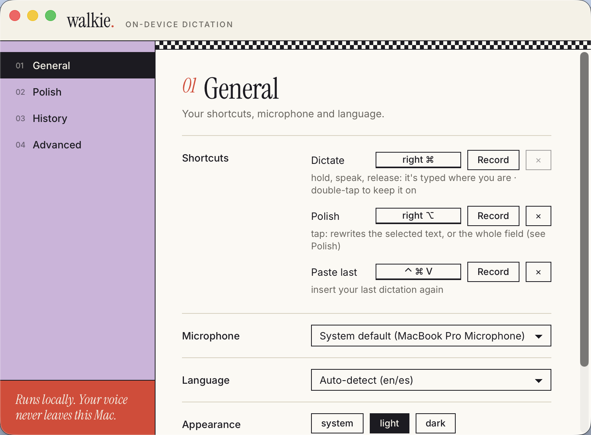

# Walkie 📻

Local-only dictation for macOS. Hold a key, speak (English or Spanish), and
the text is typed into whatever window has focus: Claude Code, Cursor, a
browser, anything. Whisper runs on your Mac; your voice never leaves it.

<p align="center">
  
</p>

## Install

1. Download `walkie-*.zip` from the
   [latest release](https://github.com/JoseanAyala/walkie/releases/latest),
   unzip it and move `Walkie.app` to Applications.
2. The first time, right-click → **Open**. Releases are ad-hoc signed, so
   Gatekeeper doesn't know them.
3. Settings opens listing what walkie still needs (Accessibility, the
   Microphone), each with a button to the right System Settings pane; it
   picks each one up as soon as you grant it. The speech model (~570 MB)
   downloads on first launch to `~/.cache/walkie/models`.

After an update, macOS asks for those permissions again.

## Use

Default shortcuts; rebind any of them in Settings → General:

| | |
|---|---|
| **hold fn** | speak, release → the text appears (< 1s). Double-tap fn to lock it on. |
| **fn + shift** | polish: tidies the text you already have — the selection, or the whole field when nothing is selected — and puts the result in its place. It goes through a command of yours (`claude -p`, `codex exec`, ollama, …) or, optionally, Apple's on-device model (macOS 26 with Apple Intelligence on). The original stays in History. |
| **ctrl + cmd + V** | paste the last transcript again, for when it landed in the wrong window (also in the tray menu). |

The tray icon is gray when idle, red while recording and amber while it works.

## Settings

Open walkie again (or pick Settings… in the tray). Every change saves
itself.

- **General**: the shortcuts, microphone, language, appearance (Light, Dark
  or System) and launch at login.
- **Polish**: what the polish shortcut uses: your command, or Apple's
  on-device model in the tone you pick — Formal, Casual, Very casual or
  Excited (it says whether Apple Intelligence is ready).
- **History**: your past dictations, searchable, stored only on this Mac.
- **Advanced**: the speech model (with the RAM it takes), paste vs. type,
  how much to lower other audio while you speak, every check walkie runs,
  and the version.

Anything walkie still needs (a permission, a mic) is listed above every
page, with a button to fix it. Every change applies at once; nothing needs
a restart.

Launch at login is a real macOS login item (System Settings → General →
Login Items); it needs the installed app, not `cargo tauri dev`.
`walkie --login-item status|on|off` does the same from a terminal. If the
chosen mic is unplugged, walkie records from the system default and
Settings says so.

## Config

Settings writes `~/.config/walkie/config.toml`; you can edit it too.

```toml
[polish]
provider = "command"         # or "apple": Apple's on-device model (optional)
tone = "formal"              # Apple's model: formal, casual, very_casual or excited
command = "claude -p 'Clean up this text. Output only the cleaned text.'"
timeout_secs = 60

[audio]
input_device = ""            # a name from Settings; empty = the system default
duck_while_recording = true  # lower other audio while you dictate…
duck_percent = 70            # …to this % of its volume (restored after, unless you changed it)

[theme]
appearance = "system"        # "light" | "dark"
```

History lives in `~/.local/share/walkie/history.sqlite3` (off switch in
Settings). Failed transcriptions keep their audio in `~/.cache/walkie/spool/`.

## Develop

Rust + Tauri 2; the windows are a Svelte UI in `crates/walkie-app/ui`
(bun, Vite). [AGENTS.md](AGENTS.md) maps the code.

```sh
mise install    # pinned Rust, tauri-cli, bun, actionlint (mise.toml)
make cert       # once per machine: a local signing identity
make hooks      # pre-commit: format the staged files, then lint
make run        # cargo tauri dev
make dev        # build + install + relaunch + follow the log
make help       # everything else
```

`build.rs` compiles `walkie-ai`, the small Swift helper for the optional
Apple model, with Xcode's Command Line Tools. It needs the macOS 26 SDK to
include the model; without it (or without Swift) the build still succeeds
and the app reports Apple's model as unsupported.

Local builds sign with the self-signed "walkie local signing" identity, so
macOS permission grants survive rebuilds. Ad-hoc signed, every rebuild
silently invalidates Microphone, Accessibility and Input Monitoring: the
toggles still show on but no longer apply. `walkie.entitlements` carries
`audio-input`; without it the hardened runtime mutes the mic.

`bundle.macOS.minimumSystemVersion` in `tauri.conf.json` stays at `10.15`.
`cargo tauri build` turns it into `MACOSX_DEPLOYMENT_TARGET` for the whole
build, and whisper.cpp's `std::filesystem` doesn't link below 10.15.

### Tests

```sh
make check      # fmt + lint + unit tests (Rust and UI), what CI runs
make test-stt   # real Whisper on en/es fixtures (fetches the base model)
make test-e2e   # keystrokes → engine → session → Whisper, in-process
make test-app   # the installed app, driven from outside (~30s)
```

`make test-app` (`e2e/run-app-tests.sh`) builds and installs the app, then
drives it like a person: real key events through macOS, the tray menu,
the Settings window, dictating into a bare test window. It plays
a WAV instead of the mic and uses a temp config and history, so your setup
isn't touched; `make install` puts a normal build back afterwards. It needs
Accessibility for walkie and your terminal, and "Press 🌐 key to" set to Do
Nothing. Each test must finish in 10s; a stuck one stops the run and says
where. Don't type while it runs.

### Release

```sh
make release VERSION=0.3.0
```

Bumps the version, runs `make check`, commits, tags `v0.3.0` and, once you
confirm, pushes. The tag builds an ad-hoc-signed zip (`scripts/package.sh`)
and attaches it to a GitHub Release. CI runs fmt, lint and tests on every PR
and push to `main`, and uploads a `Walkie.app` build for each push to `main`.

## License

MIT, see [LICENSE](LICENSE). The bundled fonts, Inter and Instrument Serif, are under the SIL
Open Font License.
